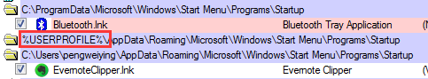

# Windows自启动项的查看和分析 技术研究和设计开发报告

## 开发环境

```
OS : Microsoft Windows 7 (6.1.7601 Service Pack 1 Build 7601)
IDE: Microsoft Visual Studio Community 2019 (16.5.5)
```

## 界面设计

由于需要开发对用户友好的图形界面，所以我在`C/C++/C#`这三种可选的编程语言中选择了`C#`。使用`C#`可以像`VB`一样使用丰富的控件实现原生`Windows`类似的`UI`、可视化布局，使用`.NET Framework`所提供的众多`API`来高效地编写代码，对熟悉`C/C++`的程序员来说上手`C#`编写实用的程序没有明显的困难。

由于我在程序前端开发和`C#`都不熟悉，所以我前期大量的时间花在学习`C# Winform`的实用控件与前端界面的实现。由于有`Autoruns`程序作为模板，所以在控件的选择上并没有选择性困难。主要用来显示自启动项的控件是`ListView`控件，仿照`Autoruns`程序显示5类信息，分别是：自启动项目名称、自启动项目描述、程序发布者、程序路径和最后修改时间。

其中花费了大量的时间的问题是下图中展示的注册表的键的路径超过当前列的范围显示到后面列的区域的问题。


默认的`ListView`是不支持这种显示效果的，文本过长时会自动截断，但是这对于显示注册表路径来说是不够友好的，需要展示完整的注册表路径需要为第一列分配很长的区域，对显示效果来说比较糟糕，所以我认为这种显示效果应该要达到而不能被妥协。

在询问老师后，我使用了`ListView`控件自定义重绘的功能实现了上述的展示效果，让键名占用4个列显示。最终程序界面的展示效果如下图所示：


在整个前端界面设计的过程中我认为比较困难的步骤有图标的展示，子项目的缩进和控件自定义重绘。

在整个前端界面的展示中使用到的`API`有
- 使用了`System.Drawing.Icon`类的`ExtractAssociatedIcon`方法从文件中提取图标
- 使用了`System.IO.FileInfo`类提取文件名、文件路径、和文件修改时间等信息
- 使用了`System.Security.Cryptography.X509Certificates.X509Certificate`类提取文件的证书，从证书提取发布者信息
- 使用了`IWshRuntimeLibrary`中的功能来提取快捷方式所指向的文件

这些有关于文件的类和方法都分布地非常分散，令我感到有些困惑，因为我认为应该有一个类来专门负责这些文件元数据的信息的读取与解析，就像我们在图形界面右键属性能够看到有关文件的所有信息一样方便快捷。

使用`IWshRuntimeLibrary`中的功能来提取快捷方式所指向的文件已知有一定的问题，在我的电脑上有解析错误的情况发生：`C:\Program Files (x86)`下的文件会解析成`C:\Program Files`下的文件，这令我对这个使用这个库产生了疑虑。

## 自启动种类

### Logon：启动目录，基于注册表启动

SysinternalsSuite中Autostart工具列出了较为详细的自启动目录和包含自启动的注册表。经过比较后我发现列出的自启动目录只有两个目录，与老师PPT中相符。分别为：
- `%USERPROFILE%\AppData\Roaming\Microsoft\Windows\Start Menu\Programs\Startup`
- `%ProgramData%\Microsoft\Windows\Start Menu\Programs\Startup`

下图中`%USERPROFILE%`环境变量autoruns没有成功解析，不知道是为什么。

由于我的windows内核版本是6，`C:\Documents and Settings`是一个`C:\Users`的链接。



在自启动键方面就有显示了很多PPT上没有提到的。我把Autoruns所有默认隐藏的选项显示出来后，在`Logon`这一栏内的所有的注册表的项罗列在附录中。

在实现注册表值的内容解析的时候，我注意到有些值的内容只有简单的一个文件名，需要到Windows操作系统的环境变量`PATH`里内去寻找。在实现这个逻辑的时候，我发现了一件异常诡异的事情，就是在`"C:\\Windows\\System32"`这个目录下原版的`Autoruns`可以找到的可执行文件我在`C#`内使用API函数返回却找不到。我一开始以为是权限不够，但是用管理员运行后还是找不到。我在网上搜索后发现`visual studio`为我的项目自动勾选了`prefer 32 bit`选项，这样编译出来的可执行文件以32位的架构运行，访问`"C:\\Windows\\System32"`会被[重定向](https://docs.microsoft.com/zh-cn/windows/win32/winprog64/file-system-redirector?redirectedfrom=MSDN)到`"C:\\Windows\\SysWOW64"`，导致找不到文件，把`prefer 32 bit`选项取消掉就正常了。

由于不含有启动项的注册表条目实在是太多，我就添加了一个隐藏空项的选项。


### Services：系统服务

###  Drivers：系统驱动程序

###  Scheduled Tasks：计划任务


## 附录

### Logon注册表

```
"HKLM\SOFTWARE\Microsoft\Windows NT\CurrentVersion\Winlogon\Userinit",
"HKLM\System\CurrentControlSet\Control\Terminal Server\Wds\rdpwd\StartupPrograms",
"HKLM\SOFTWARE\Microsoft\Windows NT\CurrentVersion\Winlogon\AppSetup",
"HKLM\Software\Policies\Microsoft\Windows\System\Scripts\Startup",
"HKCU\Software\Policies\Microsoft\Windows\System\Scripts\Logon",
"HKLM\Software\Policies\Microsoft\Windows\System\Scripts\Logon",
"HKCU\Environment\UserInitMprLogonScript",
"HKLM\Environment\UserInitMprLogonScript",
"HKLM\SOFTWARE\Microsoft\Windows NT\CurrentVersion\Winlogon\Userinit",
"HKLM\SOFTWARE\Microsoft\Windows NT\CurrentVersion\Winlogon\VmApplet",
"HKLM\Software\Policies\Microsoft\Windows\System\Scripts\Shutdown",
"HKCU\Software\Policies\Microsoft\Windows\System\Scripts\Logoff",
"HKLM\Software\Policies\Microsoft\Windows\System\Scripts\Logoff",
"HKCU\Software\Microsoft\Windows\CurrentVersion\Group Policy\Scripts\Startup",
"HKLM\Software\Microsoft\Windows\CurrentVersion\Group Policy\Scripts\Startup",
"HKCU\Software\Microsoft\Windows\CurrentVersion\Group Policy\Scripts\Logon",
"HKLM\Software\Microsoft\Windows\CurrentVersion\Group Policy\Scripts\Logon",
"HKCU\Software\Microsoft\Windows\CurrentVersion\Group Policy\Scripts\Logoff",
"HKLM\Software\Microsoft\Windows\CurrentVersion\Group Policy\Scripts\Logoff",
"HKCU\Software\Microsoft\Windows\CurrentVersion\Group Policy\Scripts\Shutdown",
"HKLM\Software\Microsoft\Windows\CurrentVersion\Group Policy\Scripts\Shutdown",
"HKCU\Software\Microsoft\Windows\CurrentVersion\Policies\System\Shell",
"HKCU\SOFTWARE\Microsoft\Windows NT\CurrentVersion\Winlogon\Shell",
"HKLM\Software\Microsoft\Windows\CurrentVersion\Policies\System\Shell",
"HKLM\SOFTWARE\Microsoft\Windows NT\CurrentVersion\Winlogon\Shell",
"HKLM\SYSTEM\CurrentControlSet\Control\SafeBoot\AlternateShell",
"HKLM\SOFTWARE\Microsoft\Windows NT\CurrentVersion\Winlogon\Taskman",
"HKLM\Software\Microsoft\Windows NT\CurrentVersion\Winlogon\AlternateShells\AvailableShells",
"HKLM\SOFTWARE\Microsoft\Windows NT\CurrentVersion\Terminal Server\Install\Software\Microsoft\Windows\CurrentVersion\Runonce",
"HKLM\SOFTWARE\Microsoft\Windows NT\CurrentVersion\Terminal Server\Install\Software\Microsoft\Windows\CurrentVersion\RunonceEx",
"HKLM\SOFTWARE\Microsoft\Windows NT\CurrentVersion\Terminal Server\Install\Software\Microsoft\Windows\CurrentVersion\Run",
"HKLM\SYSTEM\CurrentControlSet\Control\Terminal Server\WinStations\RDP-Tcp\InitialProgram",
"HKLM\SOFTWARE\Microsoft\Windows\CurrentVersion\Run",
"HKLM\SOFTWARE\Wow6432Node\Microsoft\Windows\CurrentVersion\Run",
"HKCU\SOFTWARE\Microsoft\Windows\CurrentVersion\Run",
"HKCU\SOFTWARE\Wow6432Node\Microsoft\Windows\CurrentVersion\Run",
"HKCU\SOFTWARE\Wow6432Node\Microsoft\Windows\CurrentVersion\RunOnceEx",
"HKLM\SOFTWARE\Microsoft\Windows\CurrentVersion\RunOnce",
"HKLM\SOFTWARE\Wow6432Node\Microsoft\Windows\CurrentVersion\RunOnce",
"HKCU\SOFTWARE\Microsoft\Windows\CurrentVersion\RunOnce",
"HKCU\SOFTWARE\Wow6432Node\Microsoft\Windows\CurrentVersion\RunOnce",
"HKCU\Software\Microsoft\Windows NT\CurrentVersion\Windows\Load",
"HKCU\Software\Microsoft\Windows NT\CurrentVersion\Windows\Run",
"HKLM\SOFTWARE\Microsoft\Windows\CurrentVersion\Policies\Explorer\Run",
"HKCU\SOFTWARE\Microsoft\Windows\CurrentVersion\Policies\Explorer\Run",
"HKLM\SOFTWARE\Microsoft\Active Setup\Installed Components",
"HKLM\SOFTWARE\Wow6432Node\Microsoft\Active Setup\Installed Components",
"HKLM\Software\Microsoft\Windows NT\CurrentVersion\Windows\IconServiceLib",
"HKCU\SOFTWARE\Microsoft\Windows NT\CurrentVersion\Terminal Server\Install\Software\Microsoft\Windows\CurrentVersion\Runonce",
"HKCU\SOFTWARE\Microsoft\Windows NT\CurrentVersion\Terminal Server\Install\Software\Microsoft\Windows\CurrentVersion\RunonceEx",
"HKCU\SOFTWARE\Microsoft\Windows NT\CurrentVersion\Terminal Server\Install\Software\Microsoft\Windows\CurrentVersion\Run",
"HKLM\SOFTWARE\Microsoft\Windows CE Services\AutoStartOnConnect",
"HKLM\SOFTWARE\Wow6432Node\Microsoft\Windows CE Services\AutoStartOnConnect",
"HKLM\SOFTWARE\Microsoft\Windows CE Services\AutoStartOnDisconnect",
"HKLM\SOFTWARE\Wow6432Node\Microsoft\Windows CE Services\AutoStartOnDisconnect",
```
