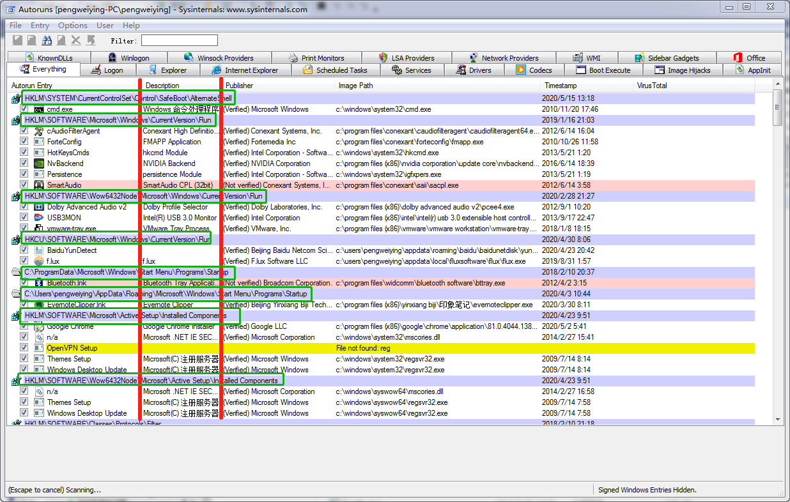
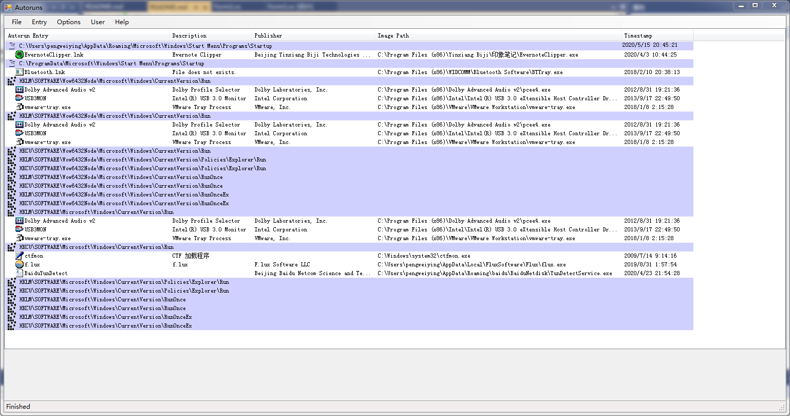

# 技术研究和设计开发报告

## 

## 界面设计

由于需要开发对用户友好的图形界面，所以我在`C/C++/C#`这三种可选的编程语言中选择了`C#`。使用`C#`可以像`VB`一样使用丰富的控件实现原生`Windows`类似的`UI`、可视化布局，使用`.NET Framework`所提供的众多`API`来高效地编写代码，对熟悉`C/C++`的程序员来说上手`C#`编写实用的程序没有明显的困难。

由于我在程序前端开发和`C#`都不熟悉，所以我前期大量的时间花在学习`C# Winform`的实用控件与前端界面的实现。由于有`Autoruns`程序作为模板，所以在控件的选择上并没有选择性困难。主要用来显示自启动项的控件是`ListView`控件，仿照`Autoruns`程序显示5类信息，分别是：自启动项目名称、自启动项目描述、程序发布者、程序路径和最后修改时间。

其中花费了大量的时间的问题是下图中展示的注册表的键的路径超过当前列的范围显示到后面列的区域的问题。



默认的`ListView`是不支持这种显示效果的，文本过长时会自动截断，但是这对于显示注册表路径来说是不够友好的，需要展示完整的注册表路径需要为第一列分配很长的区域，对显示效果来说比较糟糕，所以我认为这种显示效果应该要达到而不能被妥协。

在询问老师后，我使用了`ListView`控件自定义重绘的功能实现了上述的展示效果。最终程序界面的展示效果如下图所示：



在整个前端界面设计的过程中我认为比较困难的步骤有图标的展示，子项目的缩进和控件自定义重绘。

## 开发环境

```
OS : Microsoft Windows 7 (6.1.7601 Service Pack 1 Build 7601)
IDE: Microsoft Visual Studio Community 2019 (16.5.5)
```